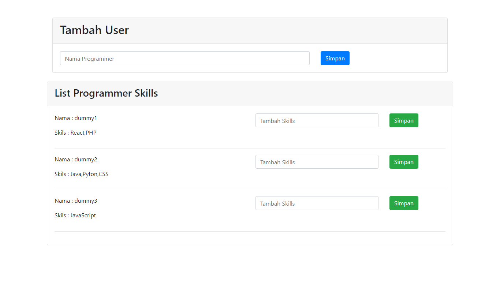

# Arkademy

## Jawaban Tes Arkademy

Jawaban No 1 - 5, bisa dijalankan melalui:
- Text Editor Online : [onlinegdb.com](https://www.onlinegdb.com/).

### No 1
- Buka code editor online: [onlinegdb.com](https://www.onlinegdb.com/).
- Copy paste kode tersebut ke onlinegdb.com.
- Maka hasilnya akan muncul berupa data json.

Note:
### REST API itu :
-  REST, singkatan bahasa Inggris dari Representational State Transfer, adalah suatu gaya arsitektur perangkat lunak untuk untuk 
    pendistibusian sistem hipermedia seperti www. Istilah ini diperkenalkan pertama kali pada tahun 2000 pada disertasi doktoral 
    Roy Fielding. Pada arsitektur REST, REST server menyediakan resources (sumber daya/data) dan REST client mengakses dan menampilkan 
    resource tersebut untuk penggunaan selanjutnya dan Rest Api adalah Fungsi" yang dapat dipanggil dan menghasilkan JSON/XML
### Kegunaan JSON pada REST API : 
- digunakan untuk melakukan pertukaran data antara bahasa pemrograman.
- berinteraksi dengan aplikasi lain 

### No 2
- Buka code editor online: [onlinegdb.com](https://www.onlinegdb.com/).
- Copy paste kode tersebut ke onlinegdb.com.
- Maka hasilnya berupa karakter acak sebanyak jumlah yang diinput di parameter dan di bungkus array.

### No 3
- Buka code editor online: [onlinegdb.com](https://www.onlinegdb.com/).
- Copy paste kode tersebut ke onlinegdb.com.
- Hasil nya akan muncul jumlah huruf pada sebuah kata.

### No 4
- Buka code editor online: [onlinegdb.com](https://www.onlinegdb.com/).
- Copy paste kode tersebut ke onlinegdb.com
- Maka hasilnya akan muncul pola sesuai soal.

### No 5
- Buka code editor online: [onlinegdb.com](https://www.onlinegdb.com/).
- Copy paste kode tersebut ke onlinegdb.com.
- Maka hasilnya berupa array dengan nilai terendah dan tertinggi.

### No 6 .
Untuk menjalankan aplikasi 6_soalArka, lakukan langkah berikut
- Aktifkan web server (apache) atau XAMPP.
- Import file sql di dalam folder 6_soalArka ke phpmyadmin.
- Pindahkan folder ArkaSoal6 ke folder HTDOCS dari aplikasi XAMPP.
- Akses url berikut: http://localhost/ArkaSoal6/view.
- Aplikasi sudah bisa digunakan.

Demo Aplikasi:

##### Credits
Thanks to Arkademy.
